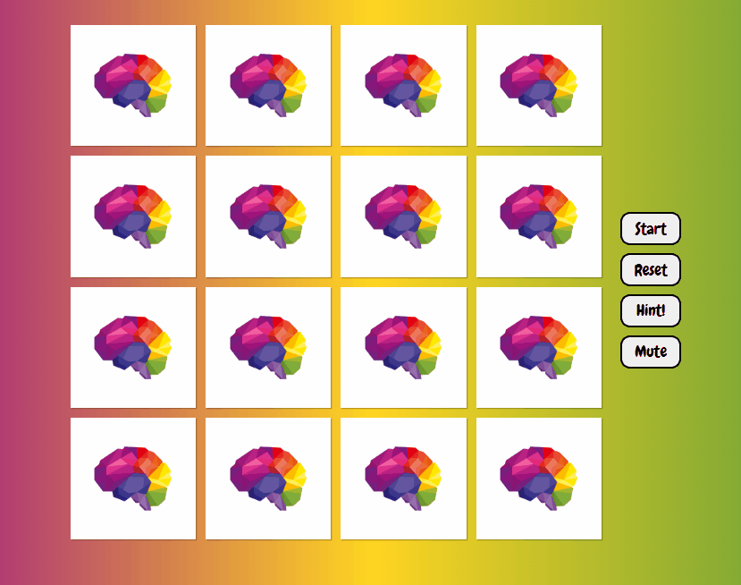
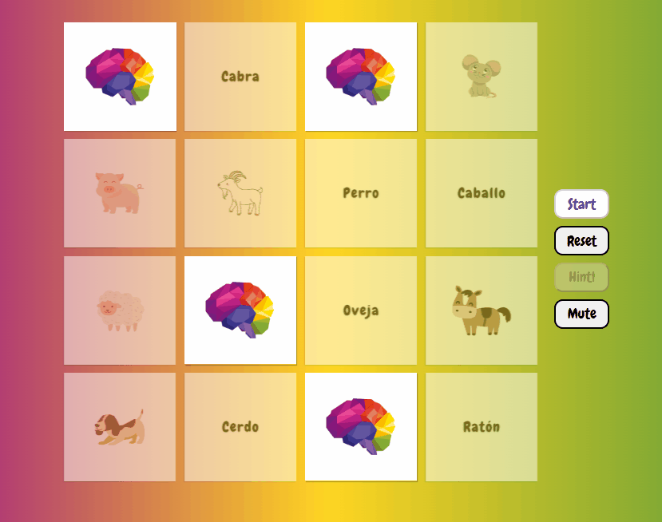
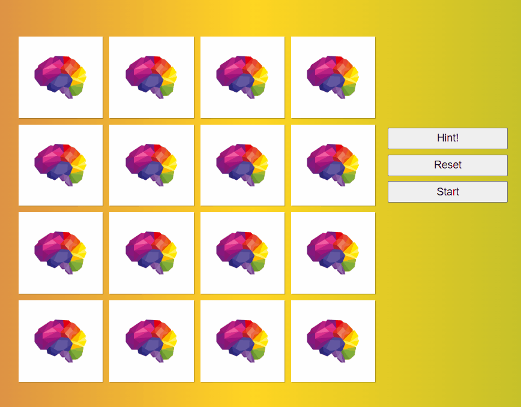

# HABLO 
Hablo is a web based memory game that focuses on cognitive building blocks, with an emphasis on matching English and Spanish words. It is designed with captivating colors that invite the user to spend time learning and having fun. Studies show it's beneficial for all ages to engage in memory based tasks, and enhances neuroplastiticity with regular exposure.
 
 ## Getting Started
 - Click the link here: http://hablo.game.com, to play! 
 - Full Documentation Here
 
 ## Features
- Expressive and intuitive UI
- Integrated JS functions
- Timed sessions
- Quick Peek button!
- Interactive playing cards

## Gameplay 
- Match animals with the correlated spanish word 

- Match all 8 animals to win the game

- Click the Hint Button for a quick peek at the cards!

HABLO Team:
- Kyle Vandenbossche: Create repo, readme.doc + CSS visibility/JS functions
- Desiree Cushing: CSS + Design Styling + Creative Wireframing
- Maggie Wernet: HTML Structure + JS Time button functionality, Cheat button functionality
- Jessica Trela: Creative Learning, JS Grid structure, JS object functionality

